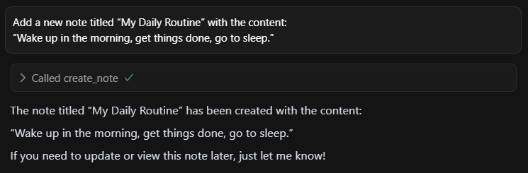
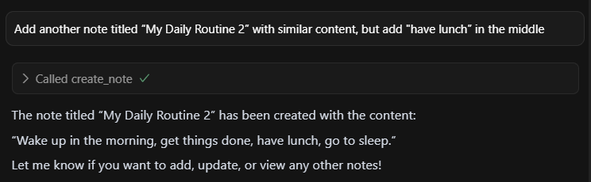

# MCP Notes Server

A Model Context Protocol (MCP) server that provides note management functionality with both STDIO and HTTP transport support.

## Overview

This project implements an MCP server for managing notes with persistent storage. It supports creating, reading, updating, and deleting notes, as well as configuring custom storage locations. The server can run in two modes:

- **STDIO mode**: For direct integration with MCP clients
- **HTTP mode**: For web-based access and testing via REST API

## Features

- ✅ **Full CRUD operations** for notes (Create, Read, Update, Delete)
- ✅ **Persistent storage** with JSON file backend
- ✅ **Configurable storage location** - set custom folders for notes
- ✅ **Dual transport support** - STDIO and HTTP
- ✅ **Session management** for HTTP mode with automatic cleanup
- ✅ **Timestamp tracking** - creation and modification dates
- ✅ **Error handling** with detailed error messages
- ✅ **CORS support** for web clients
- ✅ **Smart prompts** - Pre-built templates for common note-taking scenarios
- ✅ **Resources support** - Access notes data through MCP resources
- ✅ **Enhanced capabilities** - Full MCP protocol compliance with latest SDK

## Installation

1. Clone the repository:
```bash
git clone <repository-url>
cd notes-mcp
```

2. Install dependencies:
```bash
npm install
```

3. (Optional) Create a `.env` file to configure the data directory:
```env
DATA_DIR=./data/
PORT=3000
```

You can copy the example configuration file:
```bash
cp env-example .env
```

## Usage

### STDIO Mode (Default)

Start the server in STDIO mode for MCP client integration:

```bash
npm start
# or
node index-stdio.js
```

### HTTP Mode

Start the server in HTTP mode for web-based access:

```bash
npm run start:http
# or
node index-http.js
```

The HTTP server will start on port 3000 (or the port specified in the `PORT` environment variable).

## Available Tools

The MCP server provides the following tools:

### 1. `get_all_notes`
- **Description**: Retrieve all stored notes
- **Parameters**: None
- **Returns**: Array of all notes with metadata

### 2. `get_note`
- **Description**: Get the content of a specific note by name
- **Parameters**: 
  - `name` (string, required): Name of the note to retrieve
- **Returns**: Note object with content and metadata

### 3. `create_note`
- **Description**: Create a new note with name and content
- **Parameters**:
  - `name` (string, required): Name of the new note
  - `content` (string, required): Content of the new note
- **Returns**: Created note object with metadata

### 4. `update_note`
- **Description**: Update the content of an existing note
- **Parameters**:
  - `name` (string, required): Name of the note to update
  - `content` (string, required): New content for the note
- **Returns**: Updated note object with new modification timestamp

### 5. `delete_note`
- **Description**: Delete an existing note
- **Parameters**:
  - `name` (string, required): Name of the note to delete
- **Returns**: Deleted note object

### 6. `set_notes_folder`
- **Description**: Set the folder where notes will be stored and loaded from
- **Parameters**:
  - `folderPath` (string, required): Path to the folder where notes should be stored
- **Returns**: Success message with notes count

### 7. `get_notes_folder`
- **Description**: Get the current folder path where notes are being stored
- **Parameters**: None
- **Returns**: Current notes folder path

## Available Resources

The MCP server provides access to notes data through resources, which allow clients to access data in a structured way:

### 1. `notes://all`
- **Description**: Collection of all stored notes with full content and metadata
- **MIME Type**: `application/json`
- **Returns**: Complete notes data including content, creation, and modification timestamps

### 2. `notes://list`
- **Description**: List of all note names and metadata (without content)
- **MIME Type**: `application/json`
- **Returns**: Array of note objects with name, creation date, and modification date

Resources can be accessed by MCP clients that support the resources capability and provide a convenient way to bulk access notes data without making multiple tool calls.

## Available Prompts

The MCP server provides intelligent prompt templates to help with common note-taking scenarios:

### 1. `analyze_notes`
- **Description**: Analyze all notes to identify patterns, themes, or insights
- **Parameters**: 
  - `focus_area` (string, optional): Specific area to focus analysis on (e.g., 'trends', 'themes', 'summary')
- **Returns**: Comprehensive analysis prompt with all note content

### 2. `create_meeting_notes`
- **Description**: Template for creating structured meeting notes
- **Parameters**:
  - `meeting_type` (string, required): Type of meeting (e.g., 'standup', 'planning', 'review')
  - `attendees` (string, optional): List of meeting attendees
  - `agenda_items` (string, optional): Main agenda items to cover
- **Returns**: Structured meeting notes template

### 3. `summarize_note`
- **Description**: Create a summary of a specific note or group of notes
- **Parameters**:
  - `note_name` (string, optional): Name of the note to summarize (leave empty to summarize all notes)
  - `summary_length` (string, optional): Desired length of summary ('short', 'medium', 'long')
- **Returns**: Summarization prompt with note content

### 4. `daily_reflection`
- **Description**: Template for daily reflection notes
- **Parameters**:
  - `date` (string, optional): Date for the reflection (defaults to today)
- **Returns**: Daily reflection template with guided questions

### 5. `project_planning`
- **Description**: Template for project planning and task breakdown
- **Parameters**:
  - `project_name` (string, required): Name of the project
  - `deadline` (string, optional): Project deadline
  - `team_size` (string, optional): Number of team members
- **Returns**: Comprehensive project planning template

## Data Storage

Notes are stored in JSON format in the `data/notes_storage.json` file by default. Each note includes:

- `content`: The note's text content
- `created_at`: ISO timestamp of creation
- `modified_at`: ISO timestamp of last modification

Example storage format:
```json
{
  "note1": {
    "content": "Hello world",
    "created_at": "2025-07-01T06:09:09.881Z",
    "modified_at": "2025-07-01T06:09:09.881Z"
  }
}
```

## Project Structure

```
notes-mcp/
├── index-stdio.js          # STDIO transport entry point
├── index-http.js           # HTTP transport entry point
├── package.json            # Project configuration
├── env-example             # Environment configuration template
├── data/                   # Default data storage
│   └── notes_storage.json  # Notes database file
├── mcp-server/
│   ├── mcp-server.js       # Main MCP server implementation
│   ├── notes-service.js    # Notes service layer
│   └── storage.js          # Note storage management class
└── tests/                  # Test files
    ├── test-http.js        # HTTP transport tests
    ├── test-stdio.js       # STDIO transport tests
    ├── test-all-mcp-tools.js # Comprehensive MCP tools tests
    ├── test-prompts.js     # Prompts functionality tests
    └── test-resources.js   # Resources functionality tests
```

## HTTP API Endpoints

When running in HTTP mode, the server exposes the following endpoints:

- `POST /mcp` - Send MCP requests (tool calls, initialization)
- `GET /mcp` - Server-to-client notifications via Server-Sent Events (SSE)
- `DELETE /mcp` - Session termination

All requests require the `mcp-session-id` header (except initial initialization).

## Session Management

The HTTP server includes automatic session management:

- **Session Creation**: New sessions are created during initialization
- **Session Reuse**: Existing sessions can be reused with session ID
- **Automatic Cleanup**: Stale sessions (inactive for 30+ minutes) are automatically cleaned up every 5 minutes
- **Graceful Shutdown**: All sessions are properly closed during server shutdown

## Testing

The project includes comprehensive tests for different components:

```bash
# Test HTTP transport (requires server to be running)
node tests/test-http.js

# Test STDIO transport
node tests/test-stdio.js

# Test all MCP tools functionality
node tests/test-all-mcp-tools.js

# Test prompts functionality
node tests/test-prompts.js

# Test resources functionality
node tests/test-resources.js

# Or use npm scripts
npm run test:tools
npm run test:prompts
npm run test:resources
```

**Note**: Make sure to start the HTTP server (`npm run start:http`) before running HTTP transport tests.

## Configuration

### Environment Variables

- `DATA_DIR`: Directory for storing notes (default: `./data/`)
- `PORT`: HTTP server port (default: `3000`)

### Custom Storage Location

You can change the notes storage location at runtime using the `set_notes_folder` tool, which allows you to:

- Set a new storage directory
- Automatically load existing notes from that location
- Create the directory if it doesn't exist

### MCP Capabilities

The server implements the following MCP capabilities:

- **Tools**: Full CRUD operations for note management
- **Resources**: Bulk access to notes data with subscription support
- **Prompts**: Intelligent templates for common note-taking scenarios
- **Logging**: Debug information and error tracking
- **Completions**: Argument completion for tools and prompts

The server is built with the latest MCP SDK patterns and provides comprehensive protocol compliance.

## Dependencies

- `@modelcontextprotocol/sdk`: MCP SDK for server and client functionality
- `express`: HTTP server framework
- `dotenv`: Environment variable management

## License

MIT

## Development Notes

- The server implements proper error handling for all operations
- CORS is configured for web client compatibility
- Session management prevents memory leaks in HTTP mode
- Storage operations are synchronous for simplicity and data consistency
- All timestamps are stored in ISO format for cross-platform compatibility
- **Resources provide efficient bulk access** to notes data for MCP clients
- **Prompts offer intelligent templates** that can be used by AI assistants to help with note-taking
- **Full MCP protocol compliance** with enhanced capabilities and latest SDK patterns

## Troubleshooting

### Common Issues

1. **Permission Errors**: Ensure the data directory is writable
2. **Port Conflicts**: Change the PORT environment variable if 3000 is in use
3. **Session Issues**: Check that the `mcp-session-id` header is properly set for HTTP requests
4. **Tool Call Validation**: Some MCP SDK versions may have validation issues - check the test files for workarounds
5. **Resource Access**: If resources are not working, ensure your MCP client supports the resources capability
6. **Prompt Execution**: Some clients may have different prompt handling - test with the included prompt tests


# Example of usage in cursor:

**mcp.json**
```json
{
  "mcpServers": {
    "notes_mcp": {
      "command": "node",
      "args": [
        "c:/github/js-notes-mcp/index-stdio.js"
      ]
    }
  }
}
``` 


**notes_storage.json**
```json
{
  "My Daily Routine": {
    "content": "Wake up in the morning, get things done, go to sleep.",
    "created_at": "2025-07-03T03:27:58.978Z",
    "modified_at": "2025-07-03T03:27:58.978Z"
  }
}
```

**notes_storage.json**
```json
{
  "My Daily Routine": {
    "content": "Wake up in the morning, get things done, go to sleep.",
    "created_at": "2025-07-03T03:27:58.978Z",
    "modified_at": "2025-07-03T03:27:58.978Z"
  },
  "My Daily Routine 2": {
    "content": "Wake up in the morning, get things done, have lunch, go to sleep.",
    "created_at": "2025-07-03T03:29:13.903Z",
    "modified_at": "2025-07-03T03:29:13.903Z"
  }
}
```